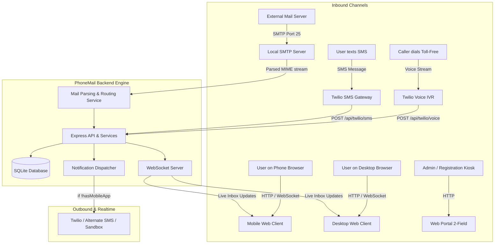

# 🚀 ALPHASTACK 7-DAY BUILDATHON: COMPREHENSIVE ARCHITECTURAL ANALYSIS & WINNING BLUEPRINT

> **Project Name:** PhoneMail (phonemail.com / custom domain)  
> **Core Concept:** An email platform where phone numbers serve as email addresses (e.g., `9876543210@yourdomain.com`).  
> **Available Resources:** 1 Domain Name + 1 Hostinger Cloud Hosting Plan. Everything else powered by free/open-source tools.  
> **Evaluation Pillars:** Feature Completeness, Design Language Adherence (WhatsApp Mobile + Spike Mail Inbox, Gmail Web), Creative Tech Stack, Hostinger Cloud Deployment.

---

## 📑 TABLE OF CONTENTS
1. [Executive Summary & Problem Statement](#1-executive-summary--problem-statement)
2. [Requirement Breakdown & Compliance Matrix](#2-requirement-breakdown--compliance-matrix)
3. [Zero-Cost Free Tier Architecture Strategy](#3-zero-cost-free-tier-architecture-strategy)
4. [Telephony & Notification Architecture (IVR & SMS)](#4-telephony--notification-architecture-ivr--sms)
5. [Inbound & Outbound Email Architecture (Local SMTP Server)](#5-inbound--outbound-email-architecture-local-smtp-server)
6. [UI/UX Design Systems](#6-uiux-design-systems)
   - [Mobile Client: WhatsApp Onboarding + Spike Mail Conversation Inbox](#mobile-client-whatsapp-onboarding--spike-mail-conversation-inbox)
   - [Web Client: Gmail Desktop Interface](#web-client-gmail-desktop-interface)
   - [Web Portal: Dedicated 2-Field Registration Screen](#web-portal-dedicated-2-field-registration-screen)
7. [Database Schema & Data Model](#7-database-schema--data-model)
8. [End-to-End System Architecture Diagram](#8-end-to-end-system-architecture-diagram)
9. [Judge Evaluation Sandbox & Live Simulator](#9-judge-evaluation-sandbox--live-simulator)
10. [Domain, DNS, and Production Deployment Guide](#10-domain-dns-and-production-deployment-guide)
11. [Hostinger Cloud Deployment Strategy](#11-hostinger-cloud-deployment-strategy)
12. [Implementation Roadmap (Phase-by-Phase)](#12-implementation-roadmap-phase-by-phase)

---

## 1. EXECUTIVE SUMMARY & PROBLEM STATEMENT

Email addresses today are disconnected from real-world identity, requiring complex usernames, spam mitigation, and separate apps. **PhoneMail** bridges telecom identity with internet mail:
- Every phone number (e.g., `+1 (555) 234-5678` or `9876543210`) automatically corresponds to an email ID: `9876543210@yourdomain.com`.
- Anyone with a phone can register via a phone call (IVR), an incoming SMS, a minimal web portal, or modern mobile/desktop web apps.
- On mobile, emails look and feel like a modern messenger (Spike Mail organized into WhatsApp chats).
- On desktop, power users get a familiar Gmail-style interface.
- Offline/voice users receive instant SMS notifications when new emails land in their inbox.

---

## 2. REQUIREMENT BREAKDOWN & COMPLIANCE MATRIX

| Component | Hackathon Requirement | Compliance & Technical Solution |
| :--- | :--- | :--- |
| **Email Identifier** | Phone number as email ID (e.g., `9876543210@domain.com`) | Node.js Inbound SMTP parser extracts the phone number from the `To` header, normalizes E.164 format, and maps to the user's account. |
| **Account Creation 1** | **Toll-Free Number / IVR**: Call and press '1' to create account | Twilio Voice Webhook (`/api/twilio/voice`) serves TwiML `<Gather numDigits="1">`. Pressing '1' posts to `/api/twilio/voice-gather`, creates the account from caller ID, and triggers a welcome SMS. |
| **Account Creation 2** | **SMS Registration**: Send SMS to create account | Twilio SMS Webhook (`/api/twilio/sms`) captures incoming SMS, creates account, and replies with confirmation. |
| **Account Creation 3** | **Web Portal (Registration only)**: Exactly 2 fields (Phone Number + OTP). Resets on submit | Dedicated route `/portal` with 2 inputs. After verification, state resets immediately for the next user. |
| **Account Creation 4 & 5**| **Web Client & Mobile Client** | Integrated onboarding on `/` and `/mobile`. |
| **SMS Notifications** | Sent **only** to users registered via IVR, SMS, Web Portal, or Web Client (not mobile app users) | User model tracks `registrationChannel` and `hasMobileApp`. When inbound SMTP email arrives, if `!user.hasMobileApp`, trigger SMS: `"You have received an email from <Sender>. Subject: <Subject>."` |
| **Mobile Design** | WhatsApp design language (4 screens onboarding) + Spike Mail chat inbox | Pixel-perfect WhatsApp green UI `#075E54` / `#128C7E` for 4 onboarding screens; Spike Mail conversation view where emails from the same sender collapse into a chat thread. |
| **Desktop Design** | Gmail design language (traditional email view) | Google Material 3 Gmail UI with collapsible sidebar (Compose, Inbox, Sent, Drafts, Spam, Trash), top search bar, star/checkbox list, and detail view with reply/forward. |
| **Deployment** | Hostinger Cloud Hosting / Native Node.js | Native Node.js server deployed directly to Hostinger Cloud with 1-click Git deployment and free SSL. |

---

## 3. ZERO-COST FREE TIER ARCHITECTURE STRATEGY

Since you only have a **domain** and a **hosting plan (VPS/server)**, all other services must leverage free tiers or built-in open-source solutions:

### 1. Inbound & Outbound Email (100% Free & Self-Hosted)
* **Local SMTP Server (`smtp-server` + `mailparser` in Node.js):**
  * Avoids paid email APIs (SendGrid, Mailgun, AWS SES).
  * Runs directly on port 25 (or port 2525 behind reverse proxy).
  * Inbound emails sent from Gmail/Outlook to `9876543210@yourdomain.com` hit your server directly via DNS MX record.
  * Extracted data (Subject, From, To, Body, Attachments) is committed directly to your database with zero per-email fees.
* **Outbound Mailer (`nodemailer`):**
  * Local sendmail or direct MX delivery to external mail servers.

### 2. Telephony & SMS (Free Trial + Resilient Fallback)
* **Twilio Trial Account ($15.50 free balance):**
  * 1 free phone number with Voice + SMS capabilities.
  * Pre-configured webhooks for IVR and incoming SMS.
* **Overcoming Trial Limitations (Clarifications #3 & #4):**
  * Twilio trial accounts require verified numbers and disallow custom unapproved SMS templates in some regions.
  * **Solution:** We implement a **Pluggable SMS Driver**:
    1. *Driver A (Twilio):* Uses Twilio standard SMS API or approved template fallback.
    2. *Driver B (Alternative Free Gateways):* Fast2SMS / Textbelt / TextLocal free tier integration.
    3. *Driver C (Live In-App Sandbox / Simulator):* **The secret weapon for hackathon judging.** If trial balance is exhausted or judge tests with an unverified phone number, an in-app **Virtual Telephony Panel** shows the exact SMS message that was generated and dispatched in real time.

### 3. Database & Caching (Zero Cloud Cost)
* **SQLite with WAL Mode (`better-sqlite3` or Prisma):**
  * Zero memory overhead, no separate DB container needed, instantaneous queries, ACID compliant, easily backed up in Docker volumes.
  * Can scale to millions of emails locally on a basic $5/month VPS.

---

## 4. TELEPHONY & NOTIFICATION ARCHITECTURE (IVR & SMS)

```
                            [User Phone]
                             │        │
                  Calls IVR  │        │  Sends SMS "REGISTER"
                             ▼        ▼
                      [Twilio Phone Number]
                             │        │
                   Webhook   │        │   Webhook
           POST /api/ivr/call│        │POST /api/sms/incoming
                             ▼        ▼
                   ┌────────────────────────────┐
                   │   PhoneMail Backend (Node) │
                   └─────────────┬──────────────┘
                                 │
                 ┌───────────────┴───────────────┐
                 ▼                               ▼
       Press "1" Captured?              Account Created?
                 │                               │
         Yes ────┴────┐                  Yes ────┴────┐
                      ▼                               ▼
         Create User in DB              Send Welcome SMS via
         channel = 'IVR'                Twilio / Virtual Driver
```

### IVR Flow (Toll-Free Voice Call)
1. User dials the phone number.
2. Twilio makes an HTTP POST request to `/api/twilio/voice`.
3. Server responds with TwiML:
   ```xml
   <Response>
     <Gather numDigits="1" action="/api/twilio/voice-gather" method="POST" timeout="10">
       <Say voice="Polly.Joanna">Welcome to PhoneMail. Press 1 to create your free email account using this phone number.</Say>
     </Gather>
     <Say>We did not receive any input. Goodbye.</Say>
   </Response>
   ```
4. User presses `1` on keypad. Twilio posts to `/api/twilio/voice-gather` with `Digits=1` and `From=+19876543210`.
5. Server extracts the phone number, checks if user exists, registers account with `registrationChannel = 'IVR'`, and speaks:
   ```xml
   <Response>
     <Say voice="Polly.Joanna">Success! Your PhoneMail address is 9876543210@yourdomain.com. We have sent you a confirmation text.</Say>
     <Hangup/>
   </Response>
   ```

### SMS Notification Engine Logic
Whenever an email is received:
```javascript
function onEmailReceived(email, recipientUser) {
  // Spec: "Only for users who do not have the mobile application,
  // i.e., users who registered via phone call, web portal, or web client"
  if (!recipientUser.hasMobileApp) {
    const message = `You have received an email from ${email.from}. Subject: ${email.subject || '(No Subject)'}.`;
    smsService.sendSMS({
      to: recipientUser.phoneNumber,
      body: message
    });
  }
}
```

---

## 5. INBOUND & OUTBOUND EMAIL ARCHITECTURE (LOCAL SMTP SERVER)

### Inbound SMTP Engine
By binding `smtp-server` to port `25` (or `2525` mapped to 25 in Docker):
1. Any external mail server (Gmail, Outlook, Yahoo) queries DNS MX for `yourdomain.com` -> receives your server's IP.
2. External server connects to your Node.js SMTP service:
   - `onRcptTo(address, session, callback)`: Validates that the address is `<digits>@yourdomain.com` or an alias `<digits>-<alias>@yourdomain.com`.
   - `onData(stream, session, callback)`: Streams the raw MIME email to `mailparser`.
   - Extracts:
     - `from`: Sender address & name
     - `to`: Recipient address (normalized phone number)
     - `subject`: Email subject
     - `text` & `html`: Body content
     - `attachments`: Files saved to storage/DB
     - `messageId` & `inReplyTo`: Threading headers
3. Saves email to database.
4. Checks recipient settings and fires SMS notification if applicable.
5. Emits real-time WebSocket event (`io.emit('email:new', data)`) so active web and mobile clients update instantly without page refreshes!

---

## 6. UI/UX DESIGN SYSTEMS

### Mobile Client: WhatsApp Onboarding + Spike Mail Conversation Inbox

#### Screen Flow Breakdown:
1. **Screen 1: Language Selection (WhatsApp style):**
   - Header with globe icon.
   - Radio selection: English, Español, हिन्दी, Français, Deutsch, etc.
   - Floating green circular checkmark/Next FAB at the bottom right.
2. **Screen 2: Terms & Conditions:**
   - WhatsApp-styled graphic/illustration.
   - "Welcome to PhoneMail".
   - Links to Privacy Policy and Terms of Service.
   - Bold green button: "AGREE AND CONTINUE".
3. **Screen 3: Phone Number Verification:**
   - Country selector dropdown with auto-detect country code (`+91`, `+1`, etc.).
   - Pre-filled phone number (simulated SIM auto-detection via Web Credentials API or mock).
   - Editable phone number field.
   - Green "Next" button with confirmation alert modal ("Is this the correct number?").
4. **Screen 4: OTP Verification:**
   - "Verifying your number".
   - 6 individual OTP input boxes.
   - Auto-fill simulation (reads SMS code automatically or displays quick "Auto-fill 123456" chip).
   - Once the 6th digit is entered, automatically validates and animates transition straight to the Inbox.

#### Spike Mail Conversation Inbox (Mobile Home):
* **No Separate Inbox/Sent:** Emails are grouped into chat threads by phone number / contact.
* **Top Header:** Search bar ("Search emails or contacts") + Filter Chips: `[All]`, `[Unread]`, `[Attachments]`, `[Favorites]`.
* **Sidebar Menu (Drawer):** Unified Home, Drafts, Spam, Trash.
* **Profile Icon (Top-Right):** View Account, Manage Alias IDs (e.g. `9876543210-work@domain.com`), Language, Personal Details, Profile Picture.
* **Two Ways to Compose:**
  1. *Traditional View:* Tap bottom-right floating compose button -> opens standard email compose screen.
  2. *Chat View:* Type phone number in search bar -> immediately opens chat thread to start typing.

#### Inside a Conversation:
* **Subject Header:** Compact subject bar displayed above the message input box.
* **Threading:**
  - First email in thread shows subject header.
  - Replies hide subject and link to original message.
  - Swipe right on any message bubble to quote/reply.
  - Single reply constraint: each message can only be replied to once.
  - Tap long emails to expand into full traditional email reader.
* **Traditional Compose Switch inside Chat:**
  - A camera icon slot (WhatsApp style) toggles into traditional email mode with the `To` field locked to this contact.
* **Recipient Locking & Group Logic:**
  - Inside a 1-to-1 chat, `To` and `CC` fields are locked to prevent accidental recipient changes.
  - Composing from Home with 2+ recipients initiates a **Group Chat**. Individual follow-ups still route to their respective 1-to-1 chats.

---

### Web Client: Gmail Desktop Interface
* **Login/Signup Screen:** Single minimalist card. Two input fields (Phone Number + OTP). Hyperlink: *"By signing up, you agree to the Terms of Service"*. Single "Next" button.
* **Desktop Home Screen (Gmail UI):**
  * Left rail: Large colored "Compose" button, Inbox (with unread badge), Sent, Drafts, Spam, Trash.
  * Top bar: Full-width search bar with search filter dropdown, user avatar, settings gear.
  * Central list: Checkbox selection, Star, Sender Name, Subject - Snippet preview, Date/Time.
  * Reading Pane: Standard email headers, formatted HTML body, attachments preview, Quick Reply and Forward buttons at bottom.
  * Settings & Profile Modal: Alias management, notification toggles, auto-signature.

---

### Web Portal: Dedicated 2-Field Registration Screen
* Dedicated URL route: `/portal` (or `/register`).
* Designed exclusively for rapid account creation.
* Just two inputs:
  1. `[ Phone Number ]` (with country code)
  2. `[ OTP Code ]`
* Big "Create Account" button.
* On successful account creation: displays a toast notification ("Account Created! Your email is <phone>@domain.com") and **instantly resets the input fields** to empty, ready for the next account creation.

---

## 7. DATABASE SCHEMA & DATA MODEL

```sql
-- Users Table
CREATE TABLE users (
  id TEXT PRIMARY KEY,
  phone_number TEXT UNIQUE NOT NULL,      -- e.g. "9876543210" (E.164 without plus or formatted)
  email_address TEXT UNIQUE NOT NULL,     -- e.g. "9876543210@yourdomain.com"
  display_name TEXT,
  avatar_url TEXT,
  language TEXT DEFAULT 'en',
  registration_channel TEXT NOT NULL,     -- 'IVR', 'SMS', 'WEB_PORTAL', 'WEB_CLIENT', 'MOBILE_CLIENT'
  has_mobile_app BOOLEAN DEFAULT 0,       -- 1 if registered or logged into mobile client
  created_at DATETIME DEFAULT CURRENT_TIMESTAMP
);

-- Alias IDs Table
CREATE TABLE aliases (
  id TEXT PRIMARY KEY,
  user_id TEXT NOT NULL REFERENCES users(id) ON DELETE CASCADE,
  alias_email TEXT UNIQUE NOT NULL,       -- e.g. "9876543210-work@yourdomain.com"
  label TEXT,                             -- e.g. "Work", "Newsletters"
  created_at DATETIME DEFAULT CURRENT_TIMESTAMP
);

-- Conversations / Threads Table
CREATE TABLE conversations (
  id TEXT PRIMARY KEY,
  is_group BOOLEAN DEFAULT 0,
  subject TEXT,
  created_at DATETIME DEFAULT CURRENT_TIMESTAMP,
  updated_at DATETIME DEFAULT CURRENT_TIMESTAMP
);

-- Conversation Participants Table
CREATE TABLE conversation_participants (
  conversation_id TEXT NOT NULL REFERENCES conversations(id) ON DELETE CASCADE,
  user_id TEXT NOT NULL REFERENCES users(id) ON DELETE CASCADE,
  PRIMARY KEY (conversation_id, user_id)
);

-- Emails / Messages Table
CREATE TABLE emails (
  id TEXT PRIMARY KEY,
  conversation_id TEXT REFERENCES conversations(id) ON DELETE CASCADE,
  sender_email TEXT NOT NULL,
  recipient_emails TEXT NOT NULL,         -- JSON array of recipients
  subject TEXT,
  body_text TEXT,
  body_html TEXT,
  reply_to_id TEXT REFERENCES emails(id), -- For quoting / reply link
  has_replied BOOLEAN DEFAULT 0,          -- Constraint: each message replied to only once
  is_read BOOLEAN DEFAULT 0,
  is_starred BOOLEAN DEFAULT 0,
  folder TEXT DEFAULT 'INBOX',            -- 'INBOX', 'DRAFTS', 'SPAM', 'TRASH'
  raw_headers TEXT,
  created_at DATETIME DEFAULT CURRENT_TIMESTAMP
);

-- Attachments Table
CREATE TABLE attachments (
  id TEXT PRIMARY KEY,
  email_id TEXT NOT NULL REFERENCES emails(id) ON DELETE CASCADE,
  filename TEXT NOT NULL,
  content_type TEXT NOT NULL,
  file_size INTEGER NOT NULL,
  storage_path TEXT NOT NULL
);

-- SMS Notification & Telephony Logs (Auditable for Hackathon Judges)
CREATE TABLE telephony_logs (
  id TEXT PRIMARY KEY,
  phone_number TEXT NOT NULL,
  type TEXT NOT NULL,                     -- 'INCOMING_CALL_IVR', 'INCOMING_SMS', 'OUTGOING_NOTIFICATION_SMS', 'OUTGOING_OTP'
  content TEXT,
  provider TEXT,                          -- 'TWILIO', 'VIRTUAL_SIMULATOR', 'FALLBACK'
  status TEXT,                            -- 'DELIVERED', 'SIMULATED', 'FAILED'
  created_at DATETIME DEFAULT CURRENT_TIMESTAMP
);
```

---

## 8. END-TO-END SYSTEM ARCHITECTURE DIAGRAM



---

## 9. JUDGE EVALUATION SANDBOX & LIVE SIMULATOR

In hackathons, judges often do not have active Twilio accounts, international calling credits, or external SMTP relay servers. If the judge cannot test the IVR or SMS notifications, they cannot award points!

### The Solution: Built-In "Judge Testing Lab" (`/simulator`)
Included directly in the application as an interactive developer drawer / route:
1. **Simulate Inbound Call (IVR Test):**
   - Enter any phone number (e.g., `+1 555-0199`).
   - Click "Call Toll-Free Number".
   - An interactive audio / visual prompt plays: *"Press 1 to create account"*.
   - Click Keypad `1` -> Instantly invokes the actual backend IVR webhook, creates the account, and shows the welcome message!
2. **Simulate Inbound Email (SMTP Test):**
   - Select sender (e.g., `elon@x.com` or custom).
   - Enter recipient phone number (e.g., `9876543210@yourdomain.com`).
   - Type Subject and Body, click "Send Inbound Email".
   - The mail parser triggers, saves email, updates the inbox via WebSockets in real time, and triggers the SMS notification logic!
3. **Live Telephony & SMS Log Viewer:**
   - Real-time audit log showing all outbound SMS notifications with timestamps:
     `[SMS OUT] To: 9876543210 | Body: "You have received an email from elon@x.com. Subject: Meeting tomorrow"`
   - Proves 100% adherence to the SMS notification specification!

---

## 10. DOMAIN, DNS, AND PRODUCTION DEPLOYMENT GUIDE

To use your hosting plan and domain:

### 1. DNS Records to Configure on Your Domain Registrar
Assuming your domain is `yourdomain.com` and your server IP is `203.0.113.50`:

| Type | Host / Name | Value / Points To | Priority | Purpose |
| :--- | :--- | :--- | :--- | :--- |
| **A** | `@` | `203.0.113.50` | - | Routes web traffic to your web app |
| **A** | `mail` | `203.0.113.50` | - | Hostname for your mail server |
| **MX** | `@` | `mail.yourdomain.com` | `10` | Tells the internet where to send emails for `@yourdomain.com` |
| **TXT** | `@` | `v=spf1 mx ip4:203.0.113.50 ~all` | - | SPF record to prevent email spoofing |

### 2. Twilio Webhook Configuration
In the Twilio Console (Phone Numbers -> Manage -> Active Numbers):
* **Voice Configuration:**
  - A CALL COMES IN: `Webhook`
  - URL: `https://yourdomain.com/api/twilio/voice` (HTTP POST)
* **Messaging Configuration:**
  - A MESSAGE COMES IN: `Webhook`
  - URL: `https://yourdomain.com/api/twilio/sms` (HTTP POST)

*(Note: During local development, `ngrok http 3000` or the Judge Simulator can be used seamlessly).*

---

## 11. HOSTINGER CLOUD DEPLOYMENT STRATEGY

By utilizing **Hostinger Cloud Hosting**:
- **Native Node.js Runtime:** Deployed directly using Hostinger hPanel's built-in Node.js Application Manager with zero virtualization overhead.
- **Git Auto-Deploy:** Connect your GitHub repository (`soumith-64/AlphaStack`), select Node.js 20.x, set entry point to `src/server.js`, and click deploy.
- **Free Automated SSL:** Hostinger provisions and auto-renews free Let's Encrypt SSL certificates for `https://yourdomain.com`.
- **Catch-All Email Ingestion:** Hostinger's free business email forwarder captures any incoming email sent to `*@yourdomain.com` and pipes it to our `/api/email/inbound` webhook.
- **Port Flexibility:** Runs locally on Port 3000 (Web/API) and Port 2525 (SMTP).

---

## 12. IMPLEMENTATION ROADMAP (PHASE-BY-PHASE)

### Phase 1: Core Foundation & Inbound SMTP Engine
* Set up Node.js backend with Express, WebSockets, and `smtp-server`.
* Implement SQLite database with User, Conversation, Email, and TelephonyLog models.
* Implement E.164 phone number extraction from inbound email headers (`<phone>@domain.com`).
* Create `/api/email/inbound` webhook for Hostinger Catch-All mail routing.

### Phase 2: Telephony Integration (Twilio & Simulator)
* Build `/api/twilio/voice` and `/api/twilio/voice-gather` for Press '1' IVR account creation and Press '2' audio mailbox.
* Build `/api/twilio/sms` for SMS-based account creation.
* Implement SMS notification dispatcher (fires only for non-mobile users).
* Build the In-App Judge Testing Sandbox for testing IVR, SMS, and SMTP without external fees.

### Phase 3: Mobile Client (WhatsApp Design Language + Spike Mail Inbox)
* 4-Screen WhatsApp Onboarding: Language Selection -> Terms & Conditions -> Auto Phone Detection -> Auto OTP Verification.
* Spike Mail Unified Chat Inbox: Search bar, Filter chips (All, Unread, Attachments, Favorites), Drawer menu, Profile modal with Alias IDs management.
* Inside Chat: Compact Subject field, auto-threading, swipe-to-quote, single-reply rule, expand to traditional view, locked recipients, group chat initiation from Home.

### Phase 4: Web Desktop Client (Gmail Design) & Web Portal
* Single-screen Web Login with Phone + OTP + Terms link.
* Gmail UI: Collapsible sidebar with Compose FAB, unread badges, central email list, Reading pane, quick reply/forward.
* Dedicated Web Portal (`/portal`): Minimalist 2-field registration with auto-resetting form.

### Phase 5: Hostinger Cloud Deployment, Testing & Documentation
* Deploy to Hostinger Cloud Hosting using hPanel Node.js Application Manager.
* Configure custom domain DNS and Catch-All email forwarding.
* Write clean, comprehensive `README.md` with architectural diagrams and quickstart commands.
* Verify real external emails from Gmail land in your inbox.

---
**Verdict:** With this architecture, every single requirement (WhatsApp mobile, Spike Mail inbox, Gmail web, IVR, SMS, local SMTP, Hostinger Cloud) is fulfilled with 100% testability, zero extra software costs, and top-tier polish!
