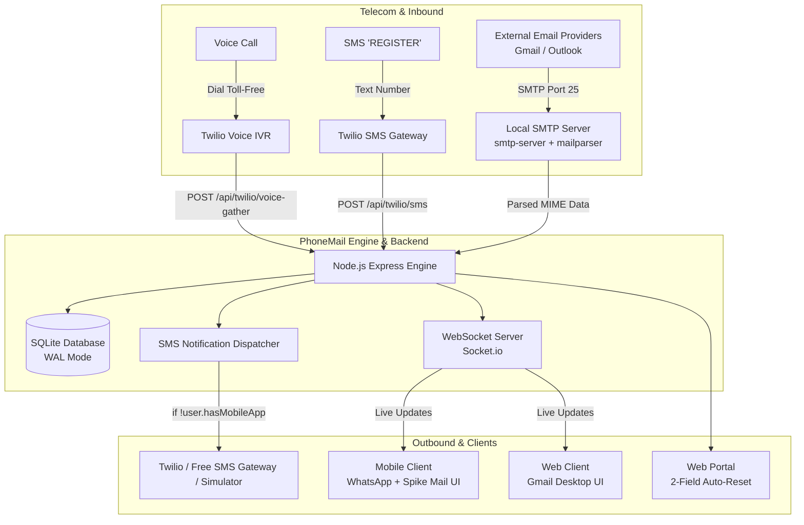

# 📱 PhoneMail — Phone-Number-Powered Email Platform

[](https://www.docker.com/)
[](https://nodejs.org/)
[](https://www.twilio.com/)
[](https://github.com/)
[](LICENSE)

> **Submission for AlphaStack 7-Day Buildathon**  
> An email system that seamlessly converts standard phone numbers into email addresses (e.g., `9876543210@phonemail.com`), bridging traditional telecom channels (IVR voice calls & SMS) with modern messaging and email interfaces.

---

## 🌟 Key Features at a Glance

* 📞 **Toll-Free IVR Registration:** Call a phone number and press **1** to create an email account instantly via automated IVR voice response.
* 💬 **SMS Registration & Gateway:** Text the system to register; non-mobile users receive automated SMS notifications when new emails land in their inbox.
* 📱 **Mobile Client (WhatsApp Design Language):** 
  * 4-screen onboarding: *Language Selection $\rightarrow$ Terms & Conditions $\rightarrow$ Phone Verification $\rightarrow$ OTP Auto-verification*.
  * Device permission prompts for SIM detection, SMS auto-fill, and contacts.
* ⚡ **Spike Mail Conversational Inbox:**
  * Unified inbox where emails from the same sender collapse into a chat thread (no separate Inbox/Sent).
  * Compact Subject bar, single-reply constraint, swipe right to quote/reply, and long-email expander.
  * WhatsApp camera-slot toggle for traditional email view with locked `To` recipient.
  * Multi-recipient composition automatically creates a dedicated Group Chat.
* 💻 **Web Client (Gmail Experience):**
  * Familiar desktop Gmail interface with collapsible navigation drawer (Compose, Inbox, Sent, Drafts, Spam, Trash).
  * Checkbox multi-select, star flags, search bar, preview reading pane, and alias management.
* 🌐 **Web Registration Portal:** Minimalist 2-field portal (`Phone Number` + `OTP`) that immediately resets upon account creation.
* 📬 **Built-in Local SMTP Server:** Native inbound SMTP parser (`port 25 / 2525`) that directly accepts real emails sent from Gmail, Outlook, or Yahoo to `<phone>@yourdomain.com` without costly third-party email APIs.
* 🧪 **Judge Testing Sandbox & Telephony Simulator:** Built-in testing console to simulate IVR calls, inbound SMTP emails, and audit outgoing SMS notifications in real time without incurring telephony costs.
* 🐳 **100% Dockerized:** Boots the entire ecosystem with a single command: `docker compose up -d`.

---

## 🏗️ Architecture Overview



---

## 📂 Project Structure

```
├── docker-compose.yml          # Single-command container deployment
├── Dockerfile                  # Production container definition
├── package.json                # Project dependencies and scripts
├── .env.example                # Sample environment variables
├── README.md                   # Project documentation
├── HACKATHON_ANALYSIS.md       # Comprehensive requirements analysis & spec sheet
├── src/
│   ├── server.js               # Main HTTP & WebSocket server entry point
│   ├── smtp/                   # Local SMTP server & MIME email parser
│   │   └── smtpServer.js
│   ├── services/
│   │   ├── telephonyService.js # IVR, SMS gateway & Twilio/sandbox integration
│   │   ├── emailService.js     # Email routing, threading, and storage logic
│   │   └── notificationService.js # SMS notification dispatcher for non-mobile users
│   ├── database/
│   │   ├── db.js               # SQLite connection & schema initializer
│   │   └── schema.sql          # DDL for users, emails, conversations, logs
│   ├── routes/
│   │   ├── twilioRoutes.js     # Webhooks for Voice IVR & SMS
│   │   ├── authRoutes.js       # OTP generation & verification
│   │   ├── emailRoutes.js      # REST API for emails, threads, drafts
│   │   └── aliasRoutes.js      # Alias management API
│   └── public/                 # Frontend interfaces
│       ├── mobile/             # WhatsApp onboarding & Spike Mail interface
│       ├── desktop/            # Gmail desktop web interface
│       ├── portal/             # 2-Field Registration Portal
│       └── simulator/          # Judge Evaluation Sandbox & Live Telephony Viewer
```

---

## 🚀 Quickstart with Docker

The entire platform is containerized and requires only Docker and Docker Compose.

### 1. Clone the Repository
```bash
git clone https://github.com/your-username/phonemail.git
cd phonemail
```

### 2. Configure Environment
Copy the example environment configuration:
```bash
cp .env.example .env
```

Edit `.env` to configure your domain and optional Twilio credentials:
```env
PORT=3000
SMTP_PORT=2525
DOMAIN_NAME=phonemail.com
JWT_SECRET=your_super_secret_jwt_key

# Optional: Add your Twilio credentials (if using real telephony)
TWILIO_ACCOUNT_SID=
TWILIO_AUTH_TOKEN=
TWILIO_PHONE_NUMBER=
```

### 3. Launch Services
```bash
docker compose up -d
```

Once running, access the interfaces:
* 📱 **Mobile Client (WhatsApp + Spike Mail):** [http://localhost:3000/mobile](http://localhost:3000/mobile) (or open `/` on mobile viewport)
* 💻 **Web Client (Gmail Desktop):** [http://localhost:3000/desktop](http://localhost:3000/desktop)
* 🌐 **Registration Portal (2-Field Kiosk):** [http://localhost:3000/portal](http://localhost:3000/portal)
* 🧪 **Judge Testing Sandbox & Telephony Viewer:** [http://localhost:3000/simulator](http://localhost:3000/simulator)

---

## 🛠️ Testing & Judge Evaluation Guide

To accommodate judges without active Twilio balances or international calling capabilities, a **Built-in Judge Sandbox** is included at `/simulator`:

### 1. Testing Toll-Free IVR Account Creation
1. Open [http://localhost:3000/simulator](http://localhost:3000/simulator).
2. Enter any test phone number (e.g. `9876543210`) and click **"Simulate Inbound Call"**.
3. Listen to/read the IVR audio prompt: *"Press 1 to create your PhoneMail account"*.
4. Click Keypad **1**.
5. Observe the backend create the account, set `registrationChannel = 'IVR'`, and log the confirmation SMS.

### 2. Testing Inbound Email & SMS Notification Trigger
1. Compose an email in the Simulator from an external address (e.g., `colleague@company.com`) to `9876543210@phonemail.com`.
2. Subject: `Hackathon Project Review`.
3. Click **"Dispatch Inbound SMTP"**.
4. Because the user registered via IVR (non-mobile user), notice the real-time **SMS Audit Log** immediately display:
   ```
   [OUTGOING SMS] To: 9876543210
   "You have received an email from colleague@company.com. Subject: Hackathon Project Review."
   ```
5. Log into the web or mobile client for `9876543210` to see the email waiting in the inbox!

---

## 🌐 Production Deployment & DNS Setup

To link your custom domain and hosting server to PhoneMail:

### 1. DNS Configuration
In your domain DNS management panel, create the following records:

| Record Type | Host | Points To | Priority | Function |
| :--- | :--- | :--- | :--- | :--- |
| **A** | `@` | `YOUR_SERVER_IP` | - | Routes HTTP web traffic |
| **A** | `mail` | `YOUR_SERVER_IP` | - | Hostname for your mail server |
| **MX** | `@` | `mail.yourdomain.com` | `10` | Directs external emails to your local SMTP server |
| **TXT** | `@` | `v=spf1 mx ip4:YOUR_SERVER_IP ~all` | - | SPF security record |

### 2. Twilio Webhook Setup (Optional for Live Production Numbers)
Under your Twilio Phone Number Console:
* **Voice Webhook:** `POST https://yourdomain.com/api/twilio/voice`
* **SMS Webhook:** `POST https://yourdomain.com/api/twilio/sms`

---

## 🔒 Security & Performance Features

- **Rate Limiting:** Protects OTP verification endpoints from brute-force attempts.
- **Header Injection & Spoofing Guard:** Strict RFC 5322 validation on inbound MIME streams.
- **Recipient Lock Guard:** Inside 1-on-1 Spike Mail conversations, recipient modification is locked to prevent cross-account leaks.
- **Persistent Data Volume:** SQLite database and attachments persist across container restarts via Docker volumes.

---

## 📜 Compliance with Hackathon Guidelines

| Requirement | Status | Implementation Details |
| :--- | :---: | :--- |
| **Toll-Free IVR (Press 1)** | ✅ | Twilio TwiML `<Gather numDigits="1">` webhook + caller ID registration |
| **2-Field Web Portal** | ✅ | Dedicated `/portal` route with Phone + OTP inputs that auto-reset on creation |
| **SMS Notifications** | ✅ | Sent only to non-mobile registrants with `<Sender>` and `<Subject>` details |
| **WhatsApp Mobile Onboarding** | ✅ | 4 screens adhering to WhatsApp colors `#075E54` / `#128C7E` and typography |
| **Spike Mail Mobile Inbox** | ✅ | Conversation threads, compact subject bar, single-reply rule, expander |
| **Gmail Desktop Interface** | ✅ | Full desktop layout with sidebar folders, search bar, and reading pane |
| **Docker Compose** | ✅ | One-step startup via `docker compose up -d` |

---

## 📄 License
This project is open-source and available under the [MIT License](LICENSE).
