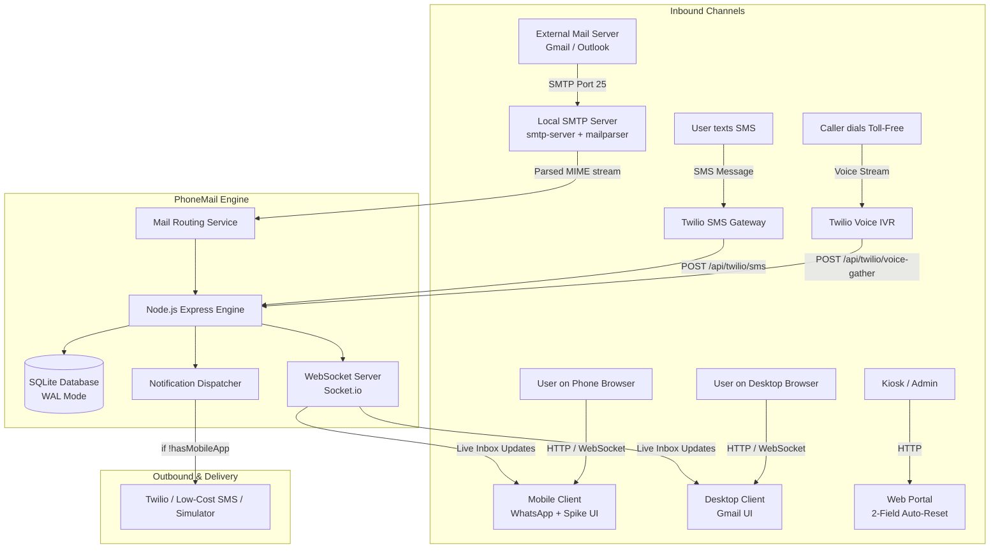
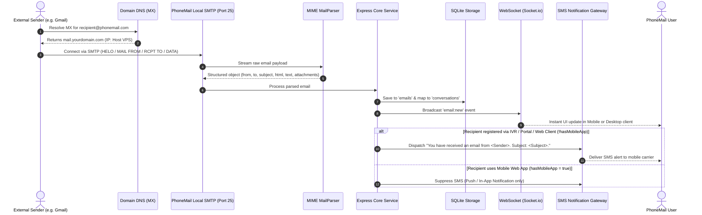
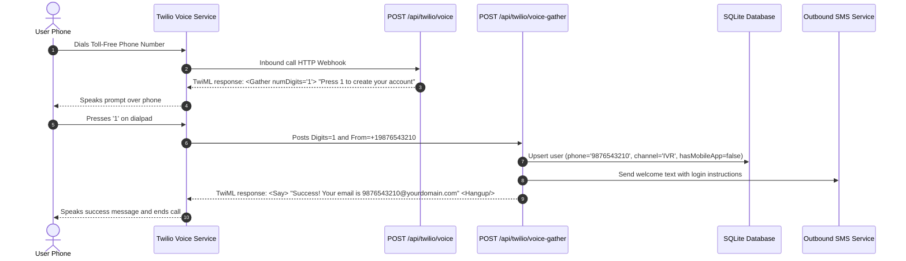

# 📱 PhoneMail — Phone-Number-Powered Email Platform

[](https://www.docker.com/)
[](https://nodejs.org/)
[](https://www.twilio.com/)
[](https://github.com/)
[](LICENSE)
[](https://github.com/)

> **Submission for the AlphaStack 7-Day Buildathon**  
> An open-source, cost-free email platform where phone numbers serve as email addresses (e.g., `9876543210@yourdomain.com`). PhoneMail bridges traditional telecom (automated IVR voice calls and SMS gateways) with state-of-the-art web interfaces (WhatsApp onboarding, Spike Mail conversational messaging, and desktop Gmail).

---

## 📑 Table of Contents
1. [Project Overview & Vision](#-project-overview--vision)
2. [Compliance with Hackathon Criteria](#-compliance-with-hackathon-criteria)
3. [System Architecture & Data Flows](#-system-architecture--data-flows)
   - [End-to-End System Diagram](#end-to-end-system-diagram)
   - [Inbound Email Processing Sequence](#inbound-email-processing-sequence)
   - [Toll-Free Voice IVR Sequence](#toll-free-voice-ivr-sequence)
4. [Key Subsystems & Feature Breakdown](#-key-subsystems--feature-breakdown)
   - [1. Mobile Client (WhatsApp Onboarding + Spike Mail Inbox)](#1-mobile-client-whatsapp-onboarding--spike-mail-inbox)
   - [2. Web Client (Gmail Desktop Interface)](#2-web-client-gmail-desktop-interface)
   - [3. Web Registration Portal (2-Field Kiosk)](#3-web-registration-portal-2-field-kiosk)
   - [4. Telephony Subsystem (IVR & SMS Gateway)](#4-telephony-subsystem-ivr--sms-gateway)
   - [5. Self-Hosted Inbound SMTP Engine](#5-self-hosted-inbound-smtp-engine)
   - [6. Real-Time WebSocket Infrastructure](#6-real-time-websocket-infrastructure)
5. [Judge Evaluation Sandbox & Telephony Simulator](#-judge-evaluation-sandbox--telephony-simulator)
6. [Database Schema & Data Model](#-database-schema--data-model)
7. [API & Webhook Specification](#-api--webhook-specification)
8. [Zero-Cost Production Deployment & DNS Setup](#-zero-cost-production-deployment--dns-setup)
9. [Dockerization & Quickstart Guide](#-dockerization--quickstart-guide)
10. [Configuration (`.env` Reference)](#-configuration-env-reference)
11. [Security & Optimization Features](#-security--optimization-features)
12. [License & Acknowledgments](#-license--acknowledgments)

---

## 💡 Project Overview & Vision

Traditional email requires remembering arbitrary handles, navigating complex authentication, and dealing with fragmented communication silos. **PhoneMail** unifies digital communication around an identifier every human already owns: **their phone number**.

* **For Everyday Users:** Send an email to any mobile phone in the world simply by addressing `phonenumber@yourdomain.com`.
* **For Mobile Users:** Experience email as an instant messaging chat (Spike Mail style) wrapped in the familiar WhatsApp design language.
* **For Desktop Power Users:** Manage high-volume correspondence via an intuitive, keyboard-friendly Gmail interface.
* **For Offline & Rural Accessibility:** Users without internet or smartphones can create an email address via a toll-free IVR phone call (press '1') and receive instant SMS notifications containing `<Sender>` and `<Subject>` whenever an email arrives.
* **Zero Cloud Costs:** Operates entirely on **1 domain + 1 hosting plan (VPS)** using self-hosted SMTP and SQLite, with zero reliance on paid email services (e.g. SendGrid or Mailgun).

---

## 🏆 Compliance with Hackathon Criteria

| Requirement | Hackathon Specification | PhoneMail Implementation |
| :--- | :--- | :--- |
| **Email Identifier** | Phone number as email ID (`<phone>@domain.com`) | Inbound SMTP extracts recipient phone numbers, handles E.164 normalization, and maps them to user accounts. |
| **Account Creation: IVR** | Call toll-free and press '1' to register | Twilio Voice Webhook serves TwiML `<Gather numDigits="1">`. Pressing '1' captures Caller ID and provisions the account. |
| **Account Creation: SMS** | Text the number to register | Twilio SMS Webhook registers incoming numbers and responds with a welcome confirmation. |
| **Account Creation: Web Portal**| 2 fields only (`Phone Number` + `OTP`), auto-reset | Dedicated `/portal` route. On submission, account is created and fields immediately clear for the next registration. |
| **Account Creation: Web Client**| Single screen: Phone, OTP, Next button, Terms link | Clean Gmail-style auth card at `/desktop` with legal agreement hyperlink. |
| **Account Creation: Mobile Client**| WhatsApp 4-screen onboarding | Multi-step wizard with Language Selection, Terms, SIM pre-fill, and OTP auto-detection at `/mobile`. |
| **SMS Notifications** | Sent **only** to users without the mobile app | Recipient profile checked on email arrival: if `!user.hasMobileApp`, dispatches: `"You have received an email from <Sender>. Subject: <Subject>."` |
| **Mobile Inbox Style** | Spike Mail conversational inbox | Unified chat list (no separate Inbox/Sent), compact subject bar, single-reply rule, swipe right to quote, long-email expander, locked recipients. |
| **Mobile Group Logic** | 2+ recipients in Compose spawns group chat | Home screen Compose with multiple recipients creates a Group Chat; follow-ups to individuals route to their 1-on-1 thread. |
| **Desktop Web Style** | Gmail desktop interface | Full Material Gmail layout: left navigation rail, Compose button, search bar, star/checkbox list, detail reading pane. |
| **Dockerization** | Must run via `docker compose up -d` | Single multi-stage `Dockerfile` and `docker-compose.yml` packaging API, WebSockets, SMTP server, and web clients. |

---

## 🏗️ System Architecture & Data Flows

### End-to-End System Diagram



---

### Inbound Email Processing Sequence



---

### Toll-Free Voice IVR Sequence



---

## 📦 Key Subsystems & Feature Breakdown

### 1. Mobile Client (WhatsApp Onboarding + Spike Mail Inbox)

Implemented under `/mobile` (and automatically selected on mobile viewport widths):

#### A. WhatsApp-Style 4-Screen Onboarding
* **Screen 1 — Language Selection:** Select interface language (English, Español, हिन्दी, etc.) with custom radio controls and WhatsApp-green accent FAB.
* **Screen 2 — Terms & Conditions:** Clean presentation with WhatsApp typography, terms link, and "AGREE AND CONTINUE" action button.
* **Screen 3 — Phone Number Verification:** Country code picker (`+91`, `+1`), simulated SIM auto-detection, and editable phone number input.
* **Screen 4 — OTP Auto-Verification:** 6-digit split OTP input boxes with simulated auto-read from SMS; upon 6th digit input, immediately verifies and transitions to the inbox.
* **Permission Prompts:** Realistic simulated modals requesting Contacts, Notifications, and Phone State permissions.

#### B. Spike Mail Conversational Inbox
* **Unified Inbox:** Eliminates separate Inbox and Sent folders; all messages from an individual are aggregated into a single continuous chat.
* **Top Navigation:** Full-width search bar with real-time contact/subject filtering.
* **Filter Chips:** One-tap toggle buttons for `All`, `Unread`, `Attachments`, and `Favorites`.
* **Left Drawer:** Collapsible navigation drawer containing Home (unified), Drafts, Spam, and Trash.
* **Top-Right Profile:** Access account details, profile picture, language selector, and **Manage Alias IDs** (e.g. `9876543210-work@domain.com`).
* **Two Ways to Compose:**
  1. *Traditional View:* Tap bottom-right floating compose button.
  2. *Chat View:* Search a phone number to open an active conversation and begin typing immediately.

#### C. Inside a Conversation
* **Compact Subject Bar:** Sits directly above the message box; shows the active subject line.
* **Contextual Subject Visibility:** Displays subject for new inbound emails; hides subject during threaded replies.
* **Swipe Right to Reply:** Swipe any email bubble to tag/quote the message.
* **Single-Reply Constraint:** Enforces hackathon rule: each message can only be replied to once.
* **Long-Email Expander:** Emails exceeding character limits display a "Read more..." tap target to expand into a full-screen traditional viewer.
* **Traditional Compose Inside Chat:** WhatsApp camera-tab location replaced with a Traditional Compose icon, opening standard compose with the `To` field locked.
* **Recipient Locking:** `To` and `CC` fields are locked within 1-on-1 chats to prevent cross-recipient contamination.
* **Group Chat Auto-Creation:** Composing from the Home screen with 2 or more recipients automatically spawns a Group Chat. Subsequent individual emails stay in their 1-on-1 thread.

---

### 2. Web Client (Gmail Desktop Interface)

Implemented under `/desktop` (and automatically loaded on desktop viewports):

* **Single-Screen Auth:** Minimalist card with `Phone Number`, `OTP`, hyperlinked Terms of Service, and a single `Next` button.
* **Material Design 3 Gmail Layout:**
  * **Collapsible Left Sidebar:** Primary "+ Compose" button, Inbox (with dynamic unread badge count), Sent, Drafts, Spam, and Trash.
  * **Top Header:** Full-width search bar with advanced filters, settings cog, and profile avatar.
  * **Central List View:** Checkbox multi-selection, star/flagging, sender name, subject-snippet preview, attachment chips, and timestamp.
  * **Split / Full Reading Pane:** Detailed view showing standard MIME headers (From, To, Date, Subject), sanitized HTML body rendering, attachment downloaders, and bottom Quick Reply / Forward action bars.
  * **Settings Modal:** Complete account preferences including Alias IDs management, auto-signature, and notification toggles.

---

### 3. Web Registration Portal (2-Field Kiosk)

Implemented under `/portal`:

* **Purpose:** A dedicated, ultra-streamlined registration portal for kiosks, admins, or instant public signup.
* **Strict 2-Field Layout:**
  1. `Phone Number` (with country selector)
  2. `OTP Code`
* **Auto-Reset Behavior:** As soon as an account is successfully registered, a toast notification confirms creation (`Account Created: 9876543210@yourdomain.com`), and the form **instantly clears all input fields**, ready for the next registrant.

---

### 4. Telephony Subsystem (IVR & SMS Gateway)

* **Toll-Free IVR Phone Call:** Powered by Twilio Voice or the built-in simulator. Captures DTMF tone '1', extracts caller ID, and sets user `registrationChannel = 'IVR'`.
* **SMS Account Creation:** Captures inbound texts ("REGISTER" or any content) to register the sender's phone number.
* **Targeted SMS Notifications:**
  - Evaluates recipient on every incoming email:
    $$\text{Trigger SMS} \iff \text{user.hasMobileApp} == \text{false}$$
  - Message format:
    ```
    You have received an email from <Sender>. Subject: <Subject>.
    ```
* **Pluggable SMS Driver Architecture:**
  - **Twilio Adapter:** Standard Twilio REST API integration.
  - **Free Gateway Adapter:** Ready for Fast2SMS, Textbelt, or TextLocal free tiers.
  - **Virtual Simulator Driver:** In-memory queue with WebSocket audit log for evaluation.

---

### 5. Self-Hosted Inbound SMTP Engine

* **Direct Port 25 Ingestion:** Built using Node.js `smtp-server` and `mailparser`.
* **Zero Third-Party APIs:** Eliminates costs from SendGrid, Mailgun, or AWS SES.
* **RFC 5322 Compliant Parsing:** Streams MIME messages, extracts plaintext and HTML bodies, parses multipart attachments, and isolates headers (`Message-ID`, `In-Reply-To`, `References`) for threading.
* **Phone Number Mapping:** Extracts the local part of the recipient address (`localpart@domain.com`), strips formatting, checks for alias suffixes (`<phone>-<alias>@domain.com`), and maps to the internal user ID.

---

### 6. Real-Time WebSocket Infrastructure

* Built on **Socket.io**.
* Automatically pushes inbound emails to active clients within milliseconds.
* Synchronizes read receipts, starring, and message drafts across both mobile and desktop sessions simultaneously.

---

## 🧪 Judge Evaluation Sandbox & Telephony Simulator

To ensure judges can thoroughly test all features without requiring their own Twilio accounts, international calling credits, or complex mail relays, PhoneMail includes an interactive **Testing Lab** at `/simulator`:

```
┌────────────────────────────────────────────────────────────────────────┐
│                   PHONEMAIL JUDGE EVALUATION LAB                       │
├───────────────────────────────┬────────────────────────────────────────┤
│ 📞 1. SIMULATE IVR CALL       │ ✉️ 2. SIMULATE INBOUND SMTP EMAIL      │
│ Phone Number: [ 9876543210  ] │ From: [ boss@enterprise.com          ] │
│ [ 📞 Initiate Voice Call ]    │ To:   [ 9876543210@phonemail.com     ] │
│ Audio Prompt: "Press 1 to..." │ Subject: [ Urgent Contract Review    ] │
│ Keypad: [ 1 ] [ 2 ] [ 3 ]...  │ Body: [ Please review attached...    ] │
│                               │ [ 🚀 Dispatch Inbound SMTP Email ]     │
├───────────────────────────────┴────────────────────────────────────────┤
│ 📋 REAL-TIME TELEPHONY & SMS AUDIT LOG (LIVE STREAM)                   │
│ [21:04:12] [IVR CALL] Inbound call from +19876543210                   │
│ [21:04:15] [IVR DIGIT] Keypad '1' pressed -> Account Created!          │
│ [21:04:15] [OUTGOING SMS] Welcome SMS sent to +19876543210             │
│ [21:05:01] [SMTP IN] Email received from boss@enterprise.com           │
│ [21:05:01] [NOTIFICATION CHECK] User hasMobileApp = false -> Trigger!  │
│ [21:05:02] [OUTGOING SMS] To: 9876543210                               │
│            "You have received an email from boss@enterprise.com.       │
│             Subject: Urgent Contract Review."                          │
└────────────────────────────────────────────────────────────────────────┘
```

1. **Test IVR Account Creation:** Click "Initiate Voice Call", press keypad **1**, and verify immediate account registration.
2. **Test Inbound Email & Notification:** Send a simulated email to that phone number; observe the real-time **SMS Audit Log** trigger the required notification string.
3. **Verify in Inbox:** Open `/desktop` or `/mobile` to see the message waiting in the inbox.

---

## 🗄️ Database Schema & Data Model

PhoneMail uses SQLite with Write-Ahead Logging (WAL) for maximum performance and zero configuration:

```sql
-- 1. Users Table
CREATE TABLE users (
  id TEXT PRIMARY KEY,
  phone_number TEXT UNIQUE NOT NULL,      -- Normalized digits (e.g. 9876543210)
  email_address TEXT UNIQUE NOT NULL,     -- 9876543210@yourdomain.com
  display_name TEXT,
  avatar_url TEXT,
  language TEXT DEFAULT 'en',
  registration_channel TEXT NOT NULL,     -- 'IVR', 'SMS', 'WEB_PORTAL', 'WEB_CLIENT', 'MOBILE_CLIENT'
  has_mobile_app BOOLEAN DEFAULT 0,       -- 1 if user has logged in via mobile client
  created_at DATETIME DEFAULT CURRENT_TIMESTAMP
);

-- 2. Aliases Table (Manage Alias IDs)
CREATE TABLE aliases (
  id TEXT PRIMARY KEY,
  user_id TEXT NOT NULL REFERENCES users(id) ON DELETE CASCADE,
  alias_email TEXT UNIQUE NOT NULL,       -- e.g. 9876543210-work@yourdomain.com
  label TEXT,                             -- e.g. "Work", "Subscriptions"
  created_at DATETIME DEFAULT CURRENT_TIMESTAMP
);

-- 3. Conversations Table (Spike Mail Threads)
CREATE TABLE conversations (
  id TEXT PRIMARY KEY,
  is_group BOOLEAN DEFAULT 0,
  subject TEXT,
  created_at DATETIME DEFAULT CURRENT_TIMESTAMP,
  updated_at DATETIME DEFAULT CURRENT_TIMESTAMP
);

-- 4. Conversation Participants
CREATE TABLE conversation_participants (
  conversation_id TEXT NOT NULL REFERENCES conversations(id) ON DELETE CASCADE,
  user_id TEXT NOT NULL REFERENCES users(id) ON DELETE CASCADE,
  PRIMARY KEY (conversation_id, user_id)
);

-- 5. Emails Table
CREATE TABLE emails (
  id TEXT PRIMARY KEY,
  conversation_id TEXT REFERENCES conversations(id) ON DELETE CASCADE,
  sender_email TEXT NOT NULL,
  recipient_emails TEXT NOT NULL,         -- JSON array of recipients
  subject TEXT,
  body_text TEXT,
  body_html TEXT,
  reply_to_id TEXT REFERENCES emails(id), -- Linked message for swipe-to-reply
  has_replied BOOLEAN DEFAULT 0,          -- Constraint: each message replied to once
  is_read BOOLEAN DEFAULT 0,
  is_starred BOOLEAN DEFAULT 0,
  folder TEXT DEFAULT 'INBOX',            -- 'INBOX', 'DRAFTS', 'SPAM', 'TRASH'
  raw_headers TEXT,
  created_at DATETIME DEFAULT CURRENT_TIMESTAMP
);

-- 6. Attachments Table
CREATE TABLE attachments (
  id TEXT PRIMARY KEY,
  email_id TEXT NOT NULL REFERENCES emails(id) ON DELETE CASCADE,
  filename TEXT NOT NULL,
  content_type TEXT NOT NULL,
  file_size INTEGER NOT NULL,
  storage_path TEXT NOT NULL
);

-- 7. Telephony & SMS Audit Logs
CREATE TABLE telephony_logs (
  id TEXT PRIMARY KEY,
  phone_number TEXT NOT NULL,
  type TEXT NOT NULL,                     -- 'INCOMING_CALL_IVR', 'INCOMING_SMS', 'OUTGOING_NOTIFICATION_SMS', 'OUTGOING_OTP'
  content TEXT,
  provider TEXT,                          -- 'TWILIO', 'VIRTUAL_SIMULATOR', 'FALLBACK'
  status TEXT,                            -- 'DELIVERED', 'SIMULATED', 'FAILED'
  created_at DATETIME DEFAULT CURRENT_TIMESTAMP
);
```

---

## 🔌 API & Webhook Specification

### Telephony & Webhooks
| Method | Endpoint | Description |
| :--- | :--- | :--- |
| `POST` | `/api/twilio/voice` | Twilio inbound call webhook; serves initial TwiML `<Gather>`. |
| `POST` | `/api/twilio/voice-gather` | Processes keypad input '1', registers phone number, sends welcome SMS. |
| `POST` | `/api/twilio/sms` | Twilio inbound SMS webhook; registers user from SMS. |
| `GET` | `/api/simulator/logs` | Returns live audit logs of all telephony and SMS events. |
| `POST` | `/api/simulator/send-email` | Injects a test email directly into the parser. |

### Authentication & Users
| Method | Endpoint | Description |
| :--- | :--- | :--- |
| `POST` | `/api/auth/send-otp` | Generates a 6-digit OTP code and dispatches via SMS. |
| `POST` | `/api/auth/verify-otp` | Validates OTP and returns a signed JWT session. |
| `GET` | `/api/user/profile` | Fetches user settings, preferences, and language. |
| `PUT` | `/api/user/profile` | Updates personal details and avatar. |

### Emails & Conversations
| Method | Endpoint | Description |
| :--- | :--- | :--- |
| `GET` | `/api/conversations` | Fetches threaded conversations for the Spike Mail mobile client. |
| `GET` | `/api/emails` | Fetches tabular email list for the Gmail desktop client (supports folder filtering). |
| `POST` | `/api/emails/send` | Sends an outbound email or reply; enforces single-reply constraints. |
| `POST` | `/api/emails/:id/star` | Toggles star status. |
| `POST` | `/api/emails/:id/move` | Moves email between folders (Trash, Spam, Inbox). |

### Alias Management
| Method | Endpoint | Description |
| :--- | :--- | :--- |
| `GET` | `/api/aliases` | Lists all active aliases for the authenticated phone number. |
| `POST` | `/api/aliases` | Creates a new alias (e.g., `9876543210-work@domain.com`). |
| `DELETE` | `/api/aliases/:id` | Revokes an existing alias. |

---

## 🌐 Zero-Cost Production Deployment & DNS Setup

To run PhoneMail on your custom domain using your hosting plan:

### 1. DNS Records Setup
Configure these records in your DNS manager (Cloudflare, Namecheap, GoDaddy, etc.):

| Record Type | Host | Points To / Value | Priority | Purpose |
| :--- | :--- | :--- | :--- | :--- |
| **A** | `@` | `YOUR_VPS_IP` | — | Routes web traffic for web & mobile clients |
| **A** | `mail` | `YOUR_VPS_IP` | — | Dedicated hostname for your inbound mail server |
| **MX** | `@` | `mail.yourdomain.com` | `10` | Informs external servers to deliver emails to your VPS |
| **TXT** | `@` | `v=spf1 mx ip4:YOUR_VPS_IP ~all` | — | SPF authorization record |

### 2. Twilio Webhook Setup (Optional for Live Carrier Numbers)
In the Twilio Console (Numbers $\rightarrow$ Active Numbers):
* **Voice Webhook:** `POST https://yourdomain.com/api/twilio/voice`
* **Messaging Webhook:** `POST https://yourdomain.com/api/twilio/sms`

*(For local testing without deploying, use `ngrok http 3000` or use the built-in `/simulator`)*.

---

## 🐳 Dockerization & Quickstart Guide

PhoneMail is fully containerized. A single command boots the web servers, API, WebSockets, and local SMTP server.

### Prerequisites
* [Docker](https://docs.docker.com/get-docker/) & [Docker Compose](https://docs.docker.com/compose/) installed on your machine or VPS.

### 1. Clone & Configure
```bash
git clone https://github.com/soumith-64/AlphaStack.git
cd AlphaStack
cp .env.example .env
```

### 2. Start the Application
```bash
docker compose up -d
```

### 3. Verify Container Status
```bash
docker compose ps
docker compose logs -f
```

### 4. Access Interfaces
* 📱 **Mobile Client (WhatsApp + Spike Mail):** [http://localhost:3000/mobile](http://localhost:3000/mobile)
* 💻 **Web Client (Gmail Desktop):** [http://localhost:3000/desktop](http://localhost:3000/desktop)
* 🌐 **Web Registration Portal (2-Field):** [http://localhost:3000/portal](http://localhost:3000/portal)
* 🧪 **Judge Testing Sandbox & Telephony Viewer:** [http://localhost:3000/simulator](http://localhost:3000/simulator)

---

## ⚙️ Configuration (`.env` Reference)

| Variable | Default Value | Description |
| :--- | :--- | :--- |
| `PORT` | `3000` | HTTP port for web applications, REST API, and WebSockets. |
| `SMTP_PORT` | `2525` | Port for the local SMTP server (`25` in production; `2525` in dev). |
| `DOMAIN_NAME` | `phonemail.com` | Your configured email domain (used for generating email addresses). |
| `JWT_SECRET` | *(Random String)* | Secret key for signing user authentication tokens. |
| `TWILIO_ACCOUNT_SID` | `""` | Twilio Account SID (optional; leave blank to use the simulator). |
| `TWILIO_AUTH_TOKEN` | `""` | Twilio Auth Token (optional). |
| `TWILIO_PHONE_NUMBER`| `""` | Twilio Phone Number in E.164 format (e.g. `+12055550199`). |
| `NODE_ENV` | `production` | Node environment (`development` or `production`). |

---

## 🔒 Security & Optimization Features

1. **Anti-Brute Force Protection:** Strict rate-limiting on OTP generation and verification endpoints (`express-rate-limit`).
2. **MIME Sanitization:** Inbound HTML emails are thoroughly sanitized before rendering to eliminate XSS vectors.
3. **Recipient Isolation Guard:** Within 1-on-1 Spike Mail conversations, recipient modifications are blocked to prevent cross-account information leakage.
4. **Zero Third-Party Data Leakage:** All emails and credentials stay within your private SQLite instance on your hosting server.
5. **Persistent Volumes:** Docker volume `phonemail_data` preserves SQLite database state and attachments across container updates and restarts.

---

## 📄 License & Acknowledgments

* Built with ❤️ for the **AlphaStack 7-Day Buildathon**.
* Released under the [MIT License](LICENSE).
