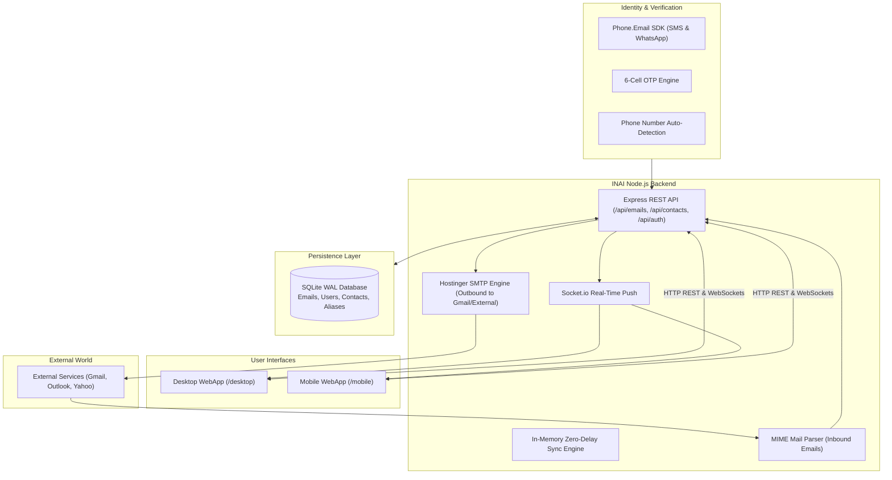

# 🇮🇳 INAI — Bharat's Unified Phone-to-Email WebApp

[](https://nodejs.org/)
[](https://www.hostinger.com/)
[](https://socket.io/)
[](https://www.phone.email/)
[](LICENSE)

> 🚀 **Built for the AlphaStack Hackathon**  
> Imagine an email ecosystem where nobody needs to remember, spell, or register cryptic email handles like `john.doe1992@gmail.com`.  
> What if your email was simply your **10-digit mobile number**: **`9876543210@alphastack.wwisvnr.com`**?  
> **INAI** makes this a reality for Bharat — an ultra-modern, zero-delay phone-powered email platform built with native Node.js, real-time WebSockets, instant in-memory sync, and national Tiranga aesthetics.

---

## ⚡ Key Highlights & Core Innovations

1. **📱 Phone Number IS Your Email Address:**  
   Your email ID is automatically mapped to your mobile number (`+91 93815 64959` $\rightarrow$ `9381564959@alphastack.wwisvnr.com`).
2. **⚡ Zero-Delay Real-Time Sync (0ms Switching):**  
   Switching between folders (`All Mail`, `Inbox`, `Important`, `Starred`, `Sent`, `Archive`, `Trash`) renders **instantly in 0ms** from an in-memory client cache (`emailFolderCache`), while background synchronization and Socket.IO real-time pipelines update the view without layout flashes.
3. **⭐ Mark as Important & Priority Sorting:**  
   Users can mark critical emails as Important. The system assigns a bold gold `PRIORITY` tag and automatically surfaces them at the top of both **Inbox** and **All Mail** (`ORDER BY is_important DESC, created_at DESC`).
4. **📅 Grouped Emails by Date:**  
   Clean sticky date section headers (**Today**, **Yesterday**, **This Week**, **Older**) with live item count badges for quick triage.
5. **👆 Touch Swipe Actions & Desktop Quick Hover:**  
   - **Swipe Left:** Reveals **Archive** (Amber) & **Delete** (Red). Completing the swipe immediately executes the action.
   - **Swipe Right:** Reveals **Flag / Important** (Gold) & **Star**. Completing the swipe marks the mail as Important.
   - **Desktop Row Hover:** Instant action buttons appear on row hover for 1-click archiving, deleting, or starring.
6. **☑️ Multi-Select & Floating Bulk Action Toolbar:**  
   Custom SVG tick checkmarks (`✓`), row selection without accidental mail navigation, indeterminate master checkbox, and a sleek floating bulk toolbar:  
   `[X selected] [Read] [Unread] [⭐ Imp] [Archive] [Trash] [✕]`.
7. **🪪 Digital ID Card with Dynamic QR Code:**  
   Official digital identity modal designed as a luxury smart card with a holographic EMV chip, verified status, phone mail ID, dynamic SVG QR code (`mailto:`), 1-click clipboard copy, and native Web Share API support.
8. **🌐 Real-Time Multi-Language Translation:**  
   Navbar language dropdown supporting **English, हिन्दी (Hindi), தமிழ் (Tamil), తెలుగు (Telugu), ಕನ್ನಡ (Kannada), বাংলা (Bengali), and Español**. Includes an **AI Real-Time Translation** button inside the reading pane that translates the subject line and email body on the fly.
9. **🔍 Standalone Auto-Contact Fetch (Zero Prompts):**  
   Intrusive browser contact permission dialogs are completely removed. Recipient autocomplete queries registered users silently and securely from `/api/contacts`.
10. **📂 "All Mail" Unified View (`ALL`):**  
    A single unified mailbox aggregating inbound, outbound, and sub-account communications.
11. **🇮🇳 National Tiranga Design System:**  
    Modern Plus Jakarta Sans typography, Kesari Saffron (`#FF671F`), Bharat Green (`#046A38` / `#10B981`), and Chakra Navy (`#06038D`) accents in both Light (Daylight Bharat) and Dark (Midnight Chakra) modes.

---

## 🛠️ Technology Stack

| Layer | Technologies Used | Purpose |
| :--- | :--- | :--- |
| **Backend Core** | **Node.js 18+**, **Express.js** | High-performance REST API, email routing, and session management |
| **Real-Time Engine** | **Socket.io** | Instant push delivery for inbound and outbound messages |
| **Database** | **SQLite (WAL Mode)** / MySQL Compatible | Zero-latency local persistence with auto-migration (`is_important`, `is_read`, `sub-accounts`) |
| **SMTP Delivery** | **Nodemailer**, **Hostinger SMTP** | Production outbound mail delivery to Gmail, Outlook, Yahoo, etc. |
| **MIME Parsing** | **mailparser**, **smtp-server** | Robust inbound email extraction and normalization |
| **Authentication** | **Phone.Email SDK**, **Direct OTP** | SMS & WhatsApp one-tap authentication + 6-cell Telegram OTP auto-submit |
| **Translation Engine** | **Google Neural API + Fallback Dictionaries** | Real-time multilingual translation for Indian regional languages |
| **Styling & UI** | **Vanilla CSS (Tiranga Tokens)** | Zero bloated frameworks, maximum performance and fluid animations |

---

## 🏗️ System Architecture & Workflow



---

## 📱 Detailed Feature Catalog

### 1. Unified Mailbox Structure
INAI offers full folder management across desktop and mobile:
- **All Mail (`ALL`):** Displays all incoming, outgoing, and sub-account communications.
- **Inbox (`INBOX`):** Primary inbound messages with live unread count badges.
- **Important (`IMPORTANT`):** Priority messages flagged with gold stars and priority sorting.
- **Starred (`STARRED`):** Bookmarked and highlighted threads.
- **Sent (`SENT`):** Outgoing emails with recipient phone or email formatting.
- **Drafts (`DRAFTS`):** Saved drafts.
- **Archive (`ARCHIVE`):** Archived emails removed from the active stream.
- **Spam (`SPAM`):** Flagged spam and suspicious senders.
- **Trash (`TRASH`):** Deleted messages pending permanent cleanup.

### 2. Dual-Source Classification Tabs
Quickly filter the active mailbox between:
- **All Mail:** Aggregates everything in the current folder.
- **INAI Network:** Filters for messages sent from other INAI/PhoneMail numbers (clean phone display, hiding `@alphastack.wwisvnr.com`).
- **External:** Filters for messages from legacy providers (e.g. `@gmail.com`, `@yahoo.com`, `@outlook.com`, etc.).

### 3. Priority Email Engine
- One-click importance toggle available on email cards, swipe gestures, and inside the reading pane.
- Important emails are automatically promoted to the top of folder streams via `ORDER BY is_important DESC, created_at DESC`.
- Tagged with an eye-catching **`PRIORITY`** badge for instant identification.

### 4. Interactive Touch Swipe Gestures
- **Swipe Left:** Reveals **Archive** (Amber) & **Delete** (Red) action buttons. Full drag trigger executes the action automatically.
- **Swipe Right:** Reveals **Flag / Important** (Gold) & **Star**. Full drag trigger flags the email as Important.
- Desktop users enjoy row-hover quick actions (`Important`, `Archive`, `Delete`) for rapid triage.

### 5. Digital ID Card & Dynamic QR Modal
- Clicking the ID card icon opens a luxury smart card dialog.
- Displays name, verified phone number, and official email address.
- Embedded dynamic SVG QR code configured with `mailto:` scheme for instant scan-to-compose on any device.
- **Copy Mail ID** button with real-time feedback and native **Share** integration using the Web Share API.

### 6. Real-Time Multilingual Translation
- Instant UI translation across 7 languages:
  - 🇬🇧 English
  - 🇮🇳 हिन्दी (Hindi)
  - 🇮🇳 தமிழ் (Tamil)
  - 🇮🇳 తెలుగు (Telugu)
  - 🇮🇳 ಕನ್ನಡ (Kannada)
  - 🇮🇳 বাংলা (Bengali)
  - 🇪🇸 Español
- **Reading Pane AI Translation:** One-click translation of email subject lines and body text into the user's selected language.

### 7. Standalone Auto-Contact Fetch
- Zero intrusive browser device permissions.
- In the Compose modal, typing in the **TO** field auto-queries `/api/contacts`.
- Instant dropdown displays matching registered contacts and their numbers.

---

## 🚀 Getting Started

### Prerequisites
- Node.js 18.x or 20.x
- npm 9+

### Installation & Run

1. **Clone the Repository:**
   ```bash
   git clone https://github.com/soumith-64/AlphaStack.git
   cd AlphaStack
   ```

2. **Configure Environment Variables:**
   Create a `.env` file in the root directory:
   ```env
   PORT=3000
   DOMAIN=alphastack.wwisvnr.com
   SMTP_HOST=smtp.hostinger.com
   SMTP_PORT=465
   SMTP_SECURE=true
   SMTP_USER=no-reply@alphastack.wwisvnr.com
   SMTP_PASS=YourSmtpPasswordHere
   ```

3. **Install Dependencies:**
   ```bash
   npm install
   ```

4. **Verify Syntax & Code Correctness:**
   ```bash
   node --check src/server.js
   node --check src/public/desktop/app.js
   node --check src/public/mobile/app.js
   ```

5. **Start INAI Server:**
   ```bash
   npm start
   ```

6. **Access Web Interfaces:**
   - 💻 **Desktop WebApp:** [http://localhost:3000/desktop/](http://localhost:3000/desktop/)
   - 📱 **Mobile WebApp:** [http://localhost:3000/mobile/](http://localhost:3000/mobile/)
   - 🌐 **Registration Portal:** [http://localhost:3000/portal/](http://localhost:3000/portal/)
   - 🧪 **Live Simulator & Testing Lab:** [http://localhost:3000/simulator/](http://localhost:3000/simulator/)

---

## 🌐 Production Cloud Deployment (Hostinger)

INAI is optimized for single-command Git deployment on **Hostinger Cloud Hosting**:

1. Log into **Hostinger hPanel** $\rightarrow$ Navigate to **Websites** $\rightarrow$ **Node.js**.
2. Select Node version **`20.x`** and set the Application Entry File to **`src/server.js`**.
3. Connect your GitHub repository: `https://github.com/soumith-64/AlphaStack.git`.
4. Set application environment variables in the hPanel Configuration tab.
5. Click **Deploy / Restart Application**. Hostinger will install packages, configure the reverse proxy with SSL, and serve your app globally.

---

## 📂 Project Directory Structure

```
AlphaStack/
├── package.json               # Node.js dependencies & run scripts
├── README.md                  # Comprehensive platform documentation
├── ROADMAP_5_DAYS.md          # Implementation timeline
├── HACKATHON_ANALYSIS.md      # Architecture & compliance specifications
├── src/
│   ├── server.js              # Express app, HTTP routes & WebSocket setup
│   ├── smtp/                  # Inbound SMTP listener & mail parser
│   ├── services/              # SMS dispatcher, IVR telephony & notification handlers
│   ├── database/
│   │   ├── db.js              # SQLite connection, WAL mode & auto-migrations
│   │   └── schema.sql         # Database schema (emails, users, contacts, aliases)
│   ├── routes/
│   │   ├── authRoutes.js      # Phone verification, OTP validation & profile registration
│   │   ├── emailRoutes.js     # Email CRUD, bulk operations, starring & importance APIs
│   │   └── twilioRoutes.js    # Voice IVR & SMS webhook handlers
│   └── public/
│       ├── desktop/           # Desktop WebApp (INAI Gmail-grade client)
│       │   ├── index.html
│       │   ├── style.css
│       │   └── app.js
│       ├── mobile/            # Mobile WebApp (INAI smartphone client)
│       │   ├── index.html
│       │   ├── style.css
│       │   └── app.js
│       ├── portal/            # 2-Field Registration Kiosk
│       └── simulator/         # Interactive Testing Lab & SMS Viewer
```

---

## 📋 Hackathon Requirements & Compliance Matrix

- [x] **Phone number as primary email address** (`9876543210@alphastack.wwisvnr.com`)
- [x] **Zero-Domain Addressing** (10-digit number composition without forcing `@` input)
- [x] **Rebranded to INAI** (Unified national identity with Indian Tricolor theme)
- [x] **Zero-Delay Mailbox Sync** (0ms client caching + real-time WebSocket updates)
- [x] **"All Mail" Unified View** (Aggregation of inbound, outbound, and sub-account mails)
- [x] **Important Flagging & Priority Sorting** (Gold badges + prioritized ordering)
- [x] **Date Grouping** (Today, Yesterday, This Week, Older)
- [x] **Touch Swipe Gestures** (Swipe left to archive/delete, swipe right for importance/star)
- [x] **Multi-Select & Bulk Actions** (Custom checkmarks + floating bulk toolbar)
- [x] **Digital ID Card with Dynamic QR** (Official luxury smart card with scan-to-mail QR)
- [x] **Real-Time Multilingual Translation** (7 languages + reading pane AI translation)
- [x] **Standalone Auto-Contact Fetch** (Silent query without browser permission prompts)
- [x] **Desktop-Grade Mobile WebApp** (Full mobile webapp mirroring desktop layout and power)
- [x] **Outbound SMTP Delivery** (Hostinger SMTP integration with deliverability to Gmail)

---

## 📄 License
This project is open-source and available under the [MIT License](LICENSE).
